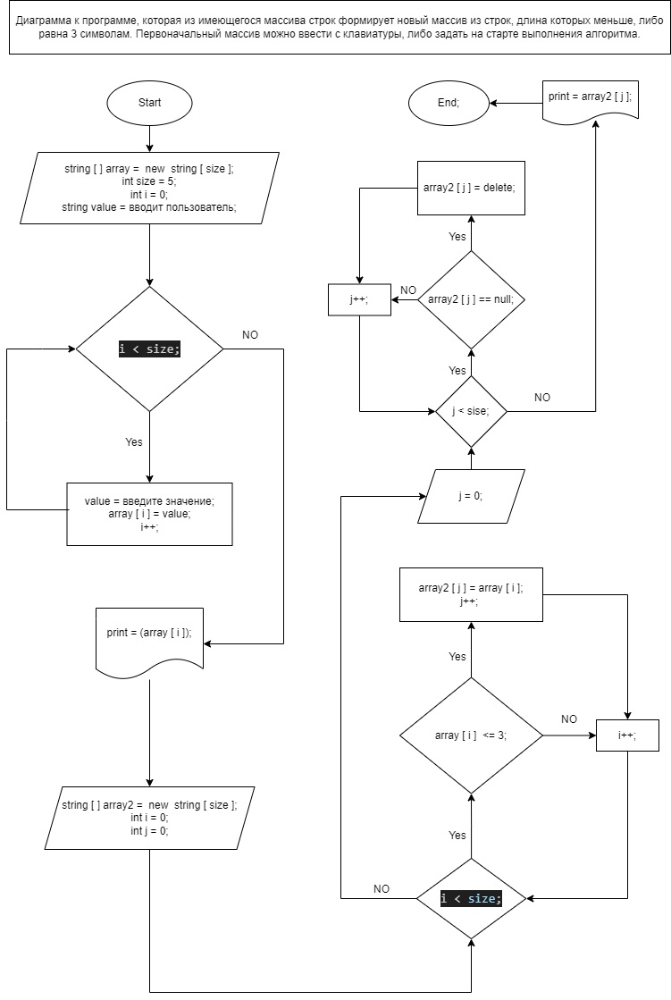

# Блок схема контрольной задачи.

# Описание решения.

1. ## *Создаем массив 1*

* Клиент вводит желаемый размер массива.

* Массив создается метом ввода значений клиентом.

* Вводить можно как числа, так и слова. Так же можно вводить смешанные значения.

* Ввод значений осуществляется до достижения значения заданного размера массива.

* В консоль выводятся значения в кавычках.

2. ## *Создаем массив 2*

* Массиву 2 задается размер аналогичный массиву 1.

* Далее проверяем каждое значение массива 1 на количество символов, до достижения размера.

* Если количество символов менее 3х или равно 3м, это значение добавляется в массив 2.

* Если количество символов более 3х пропускам и переходим к следующему.

* После проверки всех значений массива выводим в консоль массив 2.